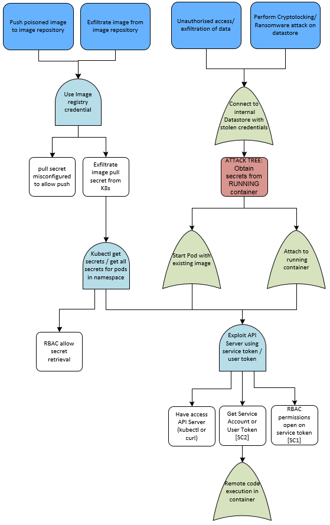

## Scenario: Compromised application leads to foothold in container

#### Assumptions:
* Compromise occurs from a vulnerable application hosted in the container

#### Details:

This scenario approaches the threat model from one of the common points of compromise, namely a compromised application running within a container.  This attack tree is displayed from the starting point of a compromised container detailing any path of exploitation.  One of the most exploited is the potential attack path focusing on a mounted and insecure service account token as detailed below.  Threats associated with a compromised user token result in a similar attack path.

Using this view it is possible to anticipate many attackers approaches, validate the mitigations required and test SIEM controls to ensure any potential attacks are discovered.

#### Full Attack Tree:
[Attack Tree - Scenario: Compromised Container](pdfs/Kubernetes%20Attack%20Trees%20v1.4.scenario.compromised.pdf "Scenario: Compromised Container")

