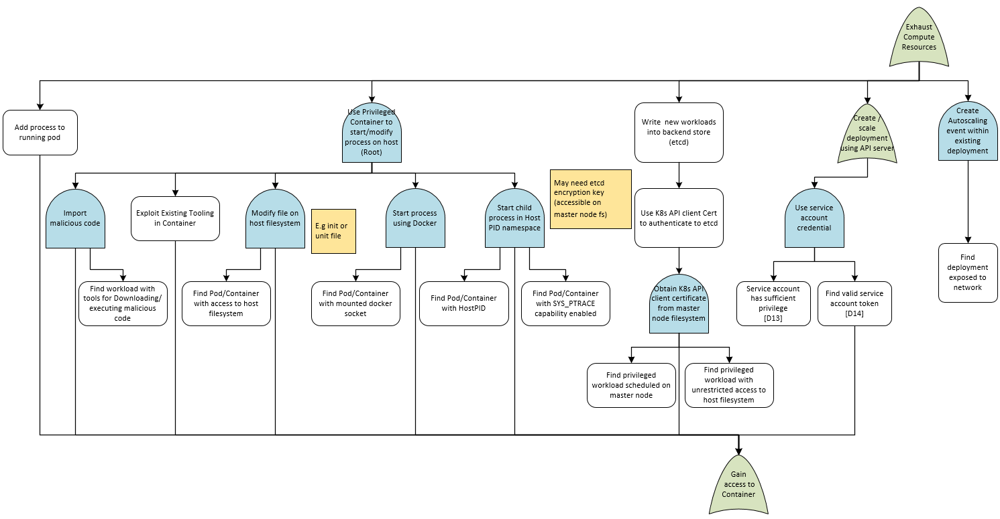
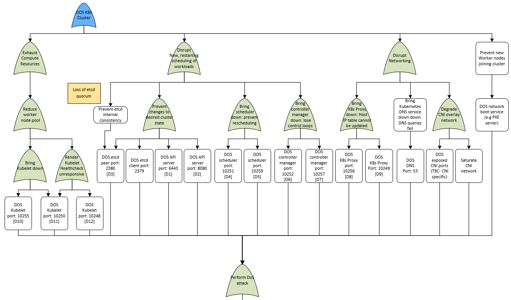

## Denial Of Service

#### Assumptions:
* Assume network access to the cluster

* Assumes no specific security controls in place, no quota's etc..

* SDLC is out of scope for this attack tree

#### Details:
This tree examines approaches where an attacker can attempt to instigate a denial of service attack on the cluster.  There are two main approaches here.  The first approach is from a container compromise scenario where the attacker could attempt to DOS the cluster from within. The second approach focuses on an attacker with network access to the cluster control plane.  Many of the attacks against control plane endpoints can be mitigated via firewalls, however the attack tree has been developed to highlight all requirements for mitigation.

##### Left Branch - From gaining access to a container

The left section of the attack tree encompassing the "Gain Access to Container" node focuses on approaches that would allow an attacker to create many additional workloads, ultimately exhausting the cluster resources and resulting in a denial of service situation for the cluster.  Perhaps the most likely threat here is the non-privileged route where an attacker could leverage the service account token to launch additional containers via the API server, this could lead to resource starvation if appropriate quota's and mitigations are not in place.
The majority of the other threats focus on what would be possible if an attacker was able to gain access to more privileged containers that are not locked down.  Performing a denial of service attack given this level of access is possible but perhaps not the most valuable to an attacker.

##### Right Branch - Perform DOS Attacks

This section focuses primarily on attempting to flood the network at the appropriate end points to exhaust resources.

#### Full Attack Tree
[Attack Tree - Denial Of Service](pdfs/Kubernetes%20Attack%20Trees%20v1.4.dos.pdf "Denial Of Service")

