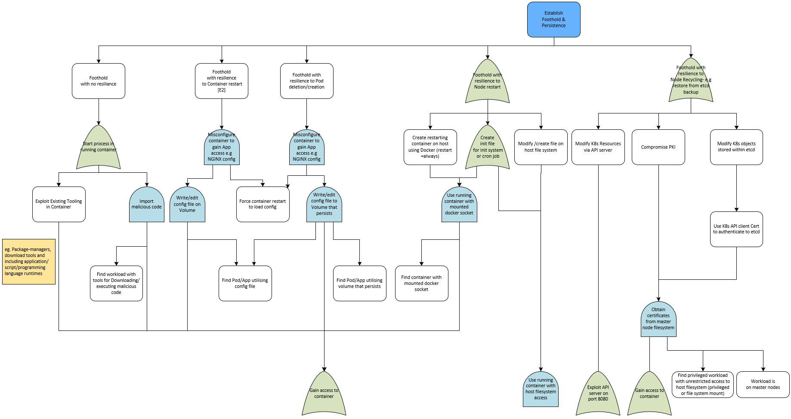
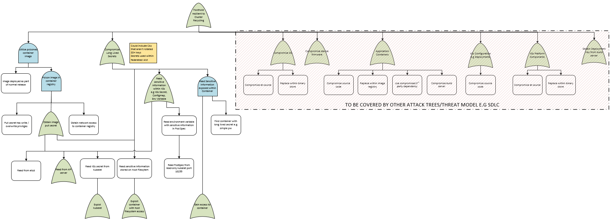

## Establish Persistence

#### Assumptions:
* Assume network access to the cluster

* Assumes no specific security controls in place

* SDLC is out of scope for this attack tree

#### Details:
The aim of this tree is to discover the several ways an attacker can attempt to gain persistence in the cluster with differing periods of longevity.  There are two major branches of the tree.

The first branch focuses on the more obvious approach of reading secrets from within the cluster in order to exploit other vulnerable areas of the cluster providing a persistent foothold.

The second branch focuses on threats where an attacker has gained container access and leverages misconfigurations to establish persistence resilient to pod restarts, node restarts and container restarts respectively.

#### Full Attack Tree
[Attack Tree - Establish Persistence](pdfs/Kubernetes%20Attack%20Trees%20v1.4-persistence.pdf "Establish Persistence")

