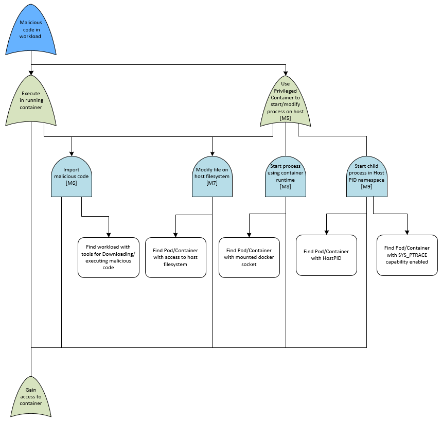
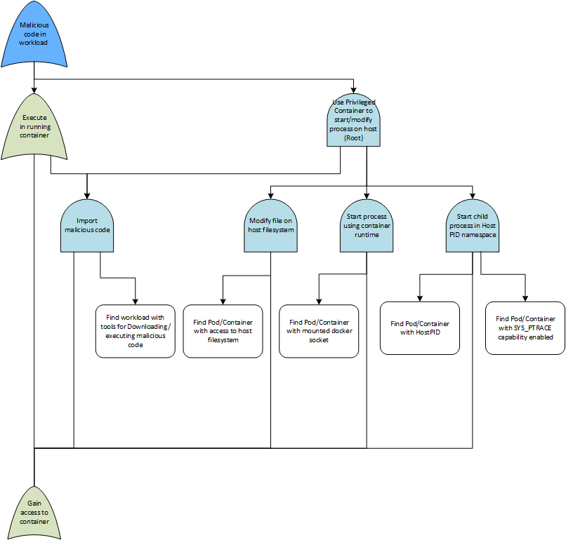

## Malicious Code Execution

#### Assumptions:
* Assume network access to the cluster

* Assume no available credentials for the cluster

* Assumes no specific security controls in place

* SDLC is out of scope for this attack tree

#### Details:

The aim of this attack tree is to execute malicious code on a cluster.  The initial foothold for these threats are primarily through a compromised application providing access to the container, this is perhaps the most likely initial foothold into the Kubernetes environment and one to carefully mitigate.  Note that the vulnerable container may be accessed from either a NodePort on a node or more likely the external network directly.  To the right of the application vulnerability branch are a compilation of threats that focus on attempting to abuse the API server to allow an attacker to exec into a running container.
This part of the attack tree is heavily re-used throughout the Attack Tree models as it is often a key point of entry for a range of attacker goals and scenarios.

Once an attacker gains access to a container the next step in this attack tree is to move towards loading additional malicious code into the environment.  There are multiple attack vectors here depending upon the privilege level of the container as noted below.

Alternatively if the Image pull secret can be obtained there is a potential that the attacker could poison the repository to distribute the malicious code from there.

As noted in the assumptions we have not fully modeled the SDLC however clearly this is a major source of potential threats to the container eco system and should be protected accordingly.  This is particularly true when protecting against malicious code execution as compromised images containing malicious code is a major source of exploitation.

#### Full Attack Tree
[Attack Tree - Malicious Code Execution](pdfs/Kubernetes%20Attack%20Trees%20v1.4.malicious.pdf "Malicious Code Execution")

