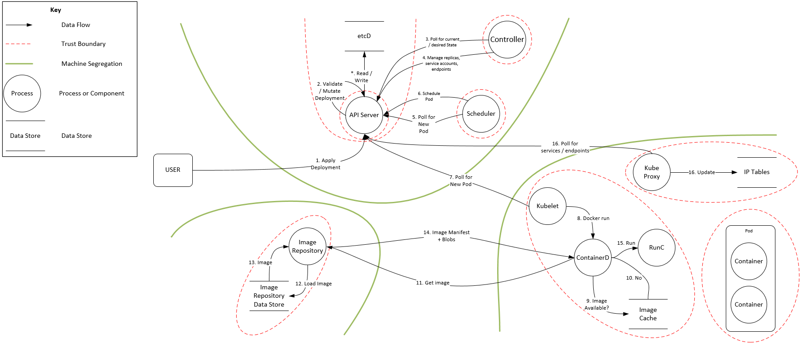
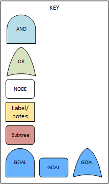

## K8s Attack Tree - Summary
The following threat model encompasses a series of attack trees and documentation targeting a generic Kubernetes installation.  The aim of this work is to provide a detailed view of threats and mitigations that can be used as a checklist to identify common attack vectors for the platform and how a would be attacker could exploit configuration vulnerabilities within Kubernetes to achieve specific goals.  This can then be used as a tool to test the security of an installation and gain visibility on the logging output that would be generated in the event of a potential attack.

We have only focused on the Kubernetes platform itself not on the full end to end container solution that would include the SDLC or additional applications used to monitor Kubernetes.  These components and the wider environment are likely to be individual to a specific end user.

This body of work is not intended to be an exhaustive study of attack vectors but shows the culmination of several weeks of analysis attempting to secure and compromise a sample cluster.  With appropriate work these attack vectors can be mitigated and monitored.  

In addition to the detailed documentation, we have written code to validate the main leaf nodes.  This is the first step to true automation.  It is our intent to codify and automate the attack trees to reduce the likelihood them becoming stale.  Research into this continues as we look to find the most appropriate schematic and execution approach.  Ideally I would like to codify the representation of the attack trees and have the ability to execute the threat model as part of an infrastructure SDLC.

### Approach
The approach taken for this work commenced with workshops examining each component of the Kubernetes architecture using the STRIDE methodology to identify potential security issues at the trust boundaries within the platform.  The base architecture examined was a single master node with etcd as a backing store servicing three worker nodes.  This elicited a series of detailed threats for each component from the container runtime to the higher level API server.  The high level architecture and associated trust boundaries discussed are shown below.

Although useful to generate the initial threats list we then took a deeper dive into each threat piecing together attack trees to identify the lineage of an initial attempt to create a foothold in the cluster to the ultimate attacker goal.  Two approaches were taken to create this work.  

#### Bottom up Approach
Firstly a bottom up approach was undertaken examining approaches that would achieve a specific goal.  This approach shows entry points throughout the Kubernetes platform with the aim of satisfying the stated goal.  The associated documentation details each leaf node providing data on the threat and approaches to validate that a mitigation has been applied.

##### Denial of Service
Prevent the system from functioning by exhausting resources within the cluster.  This goal is examined from both an external attacker viewpoint and an attacker gaining access to a container with remote execution capabilities.

##### Malicious Code Execution
The goal of this attack tree is to achieve malicious code execution in a container.

##### Establish Persistence
Maintain persistence in a Kubernetes system, this would involve compromising the platform then ensuring an ability to persist without detection

#### Scenario Approach
The second approach takes a scenario based view, identifying attack vectors open to an attacker in certain scenario's.  This approach leverages much of the detail in the first approach but in a more realistic form that can be used to provide focus on the more prevalent attack vectors.

##### Compromised application leads to foothold in container
This scenario details potential attack vectors open to an attacker once they have exploited an application running in a container.  This would lead to remote code execution within the container via programmatic or shell access mechanisms.  This is a key scenario and the focus of a number of mitigations within the Kubernetes platform to limit the capabilities of an attacker in such a scenario.

##### Attacker on the network
This scenario focuses on an internal attacker with access to the networks hosting the Kubernetes cluster.  This would likely be a more privileged user but without direct cluster access.

Following the completion of the attack trees we then detailed each leaf node in the attack tree to provide more detail on the threat along with sample code that can be used to validate that the specified threat was mitigated. Ultimately, the aim of this code is for it to be placed in the SDLC for the Kubernetes platform distribution, to ensure that threats identified by the model have been mitigated before deployment.

### Main Attack Vectors

#### Service Token
This is an obvious attack vector with multiple tutorials available online to exploit a compromised service token.  By default a service token is automatically mounted into each pod.  If a container is compromised the attacker will be provided with a mechanism of exploitation using those credentials.  This is a straight forward attack assuming container compromise.  Strict RBAC policies or disabling the automatic service token mounting are key mitigations here.

#### Compromised container
This attack vector is a major focal point within the cluster as this provides a remote execution point for an attacker.  Other than the service token attack mentioned above, other attack vectors of note include default network exposure of the control plane to all running containers.

#### Network endpoints
We present the collection of default Kubernetes endpoints, each should be secured from internal malicious actors, preventing an easy attack vector.  Note that if an attacker is able to compromise a container they gain access to the endpoints if the pods network policy permits.  Circumventing the initial external facing, layer of network protection.

#### Denial of Service
Event rate throttles are now being added to Kubernetes to mitigate denial of service attacks although this is still in its infancy.  In the 1.14 release there are relatively few mitigations against denial of service attacks.  This area should be looked at carefully with additional mitigations to prevent service outage.

#### RBAC Issues
Many attack vectors rely on mis-configuration of RBAC policies.  Given the complexity of these policies care must be taken in their creation.  Automated tooling to validate policies would be useful

### Documentation
The following pages detail the attack trees and supporting data, pulling out sub-attack trees of interest.  The key to the attack tree diagrams is as follows:

### References
CIS Benchmarks

Kubernetes.io documentation
